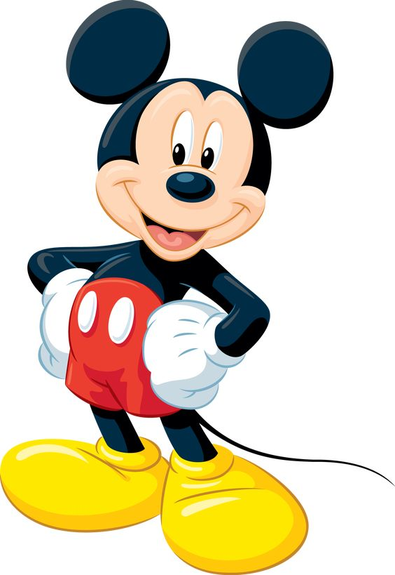

<html lang="en">
<head>
    <meta charset="UTF-8">
    <meta name="viewport" content="width=device-width, initial-scale=1.0">
    <title>Week 101 - Mickey Mouse Group</title>
    
</head>
<body>

<header>
    Week 101 - Mickey Mouse Group!
</header>

    <h2>Welcome to the Best Group of Week 101</h2>
    
    
The Mickey Mouse group is your ultimate squad for Week 101 at the University of Ottawa! If you're looking for fun, excitement, and an unforgettable frosh experience, you've come to the right place.

    
As part of the legendary Mickey Mouse group, you will be part of something magical. Our team spirit, creativity, and high energy make us the standout group during Week 101. We’re here to make sure you have an amazing start to university life.

    
Join us and experience the adventure and excitement that Mickey Mouse represents. Let’s make this the best week ever!

    <h3>Why We Can't Stand Team Dumbo</h3>
    
Let’s be real: Team Dumbo? Really? A flying elephant might be cute, but can they match the power, prestige, and sheer awesomeness of Mickey Mouse? Absolutely not!

    
Dumbo’s tiny ears can't hear how loud we're going to dominate them during Week 101. They might think they're soaring high, but we’ll bring them back down to Earth with our energy and unstoppable team spirit!

    
The Mickey Mouse group doesn’t just compete – we crush the competition. Team Dumbo, prepare yourselves because we’re coming for you, and trust us, you’re not ready for the fun storm that’s coming your way!

    
#MickeyMouseForever #DumboGoHome

<footer>
    © 2024 University of Ottawa | Week 101 | Mickey Mouse Group
</footer>

</body>
</html>

